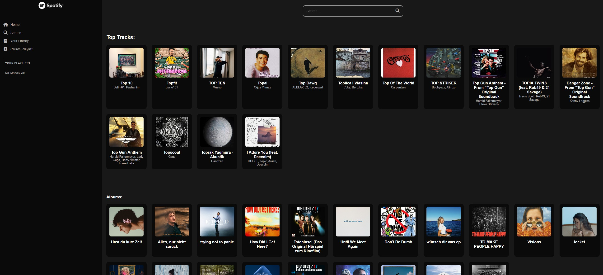
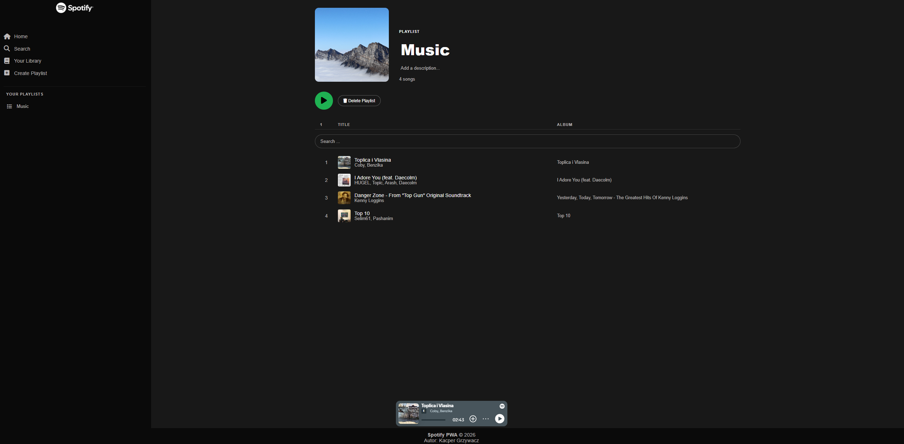

# Spotify Clone PWA (Vanilla JS + Express)

A **Progressive Web App (PWA)** music player inspired by Spotify.  
Built with **vanilla JavaScript, HTML, SCSS**, and a **Node.js/Express** backend that fetches data from the **Spotify Web API (Client Credentials Flow)**.

✅ Fully responsive UI
✅ Playlist management (CRUD) stored in LocalStorage  
✅ Offline support via Service Worker caching  
✅ Toast + system notifications

---

## Live Demo

- **App (Frontend + Backend):** https://spotify-pwa.onrender.com

- The app may take a few seconds to load due to Render cold start.

---

## Screenshots

| Home                          | Playlist                              | Mobile                            |
| ----------------------------- | ------------------------------------- | --------------------------------- |
|  |  |  |

---

## Features

### UI / UX

- Spotify-inspired interface with modern layout
- **Responsive (mobile-first)** layout for mobile, tablet and desktop
- Custom **toast notifications** + optional system notifications

### Spotify Data (API)

- Browse genres / categories
- Browse **top tracks** and **new releases**
- Track search (Spotify API)

### Playlists (LocalStorage)

- Create / edit / delete playlists
- Add / remove tracks
- Edit playlist details:
  - title
  - description
  - cover image

### PWA

- Installable app (manifest)
- **Offline mode** (cached assets) via Service Worker

---

## Tech Stack

**Frontend**

- HTML5
- JavaScript (ES6+)
- SCSS (modular structure, mixins, responsive utilities)
- Service Worker + Web App Manifest

**Backend**

- Node.js
- Express
- node-fetch
- CORS
- Rate limiting middleware

**Storage**

- LocalStorage (playlists, tracks, UI state)

**API**

- Spotify Web API (Client Credentials Flow)

---

## Architecture Overview

- The **Express backend** handles Spotify authentication and API requests.
- The **frontend** communicates with the backend using a configured `API_URL`.
- Playlists are stored locally (LocalStorage) to keep the app lightweight and avoid auth complexity.
- Service Worker caches static assets to support offline use and faster reloads.

---

## Getting Started (Local)

### 1. Clone repository

```bash
git clone https://github.com/kacpi95/Spotify-PWA.git
cd Spotify-PWA
```

### 2. Install dependencies

```bash
npm install
```

### 3. Create .env

- Create a `.env` file in the project root:

```bash
CLIENT_ID=your_spotify_client_id
CLIENT_SECRET=your_spotify_client_secret
PORT=3000
```

- You can get **CLIENT_ID** and **CLIENT_SECRET** from Spotify Developer Dashboard.

### 4. Run locally

```bash
npm run dev
```

**npm run dev starts:**

- the Express server
- the SCSS watcher (compiled into src/css)

**App runs at:**

- http://localhost:3000

## Deployment (Render)

- Deployed as a fullstack app on Render (Express serves frontend or runs alongside it).
- Make sure API_URL in your frontend service points to your deployed backend.

### Example:

- Local: http://localhost:3000
- Production: https://spotify-pwa.onrender.com

### Project Structure

```bash
src/
  css/          # Compiled CSS from SCSS
  js/           # Frontend JS (modules/services/components)
  sass/         # SCSS source files (partials, mixins, layout)
  images/       # Icons and playlist images
  pages/        # Additional HTML pages (playlist, library)
index.html      # Main HTML file
server.js       # Express backend
sw.js           # Service Worker
manifest.json   # PWA manifest
```

### Usage

1. Browse categories / top tracks / new releases
2. Search tracks
3. Create playlists and manage tracks
4. Play tracks in the built-in player
5. Install as a PWA (Add to Home Screen)
6. Offline mode works for cached assets (UI loads even without network)

### Key Challenges & Solutions

- Rate limiting added on backend to prevent API abuse and keep the app stable.
- Token handling optimized to reduce unnecessary Spotify requests.
- State and UI updates managed with LocalStorage + consistent rendering logic.
- Modular SCSS structure with mixins and responsive utilities for maintainability.

## What I Learned

This project helped me gain practical experience in building a **real-world, production-like frontend application** without relying on frameworks.

### Frontend Development

- How to structure a **vanilla JavaScript application** using modules, services, and separation of concerns
- Managing UI state and data flow without React/Vue
- Writing **maintainable SCSS** using partials, variables, mixins, and a mobile-first approach
- Implementing responsive layouts for mobile, tablet, and desktop
- Handling dynamic DOM rendering and event delegation

### Backend & API Integration

- Building a **Node.js + Express** backend as an API proxy
- Working with the **Spotify Web API** (Client Credentials Flow)
- Securing API credentials using environment variables
- Implementing **rate limiting** to protect third-party APIs
- Handling API errors and edge cases gracefully

### PWA & Performance

- Creating a **Progressive Web App** with manifest and Service Worker
- Caching static assets for **offline support**
- Improving load performance and user experience
- Understanding browser caching strategies and limitations

### State Management & Storage

- Designing a playlist system using **LocalStorage**
- Persisting application state across sessions
- Keeping UI in sync with stored data

---
